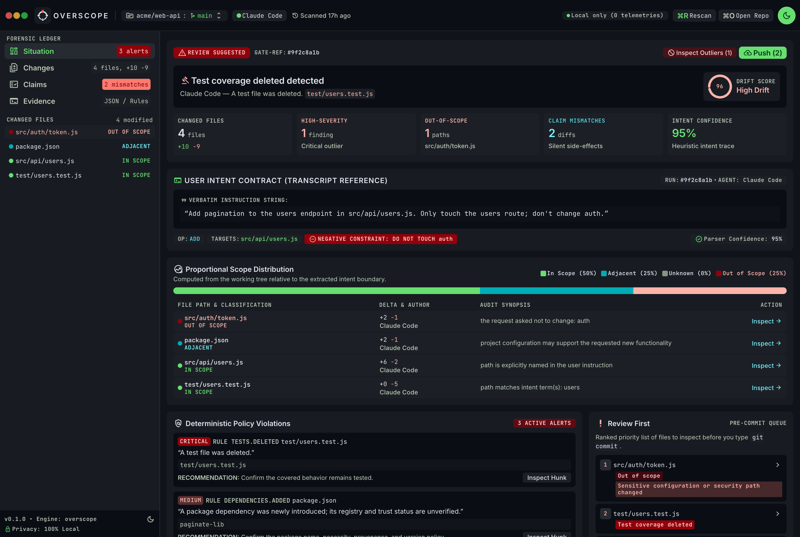
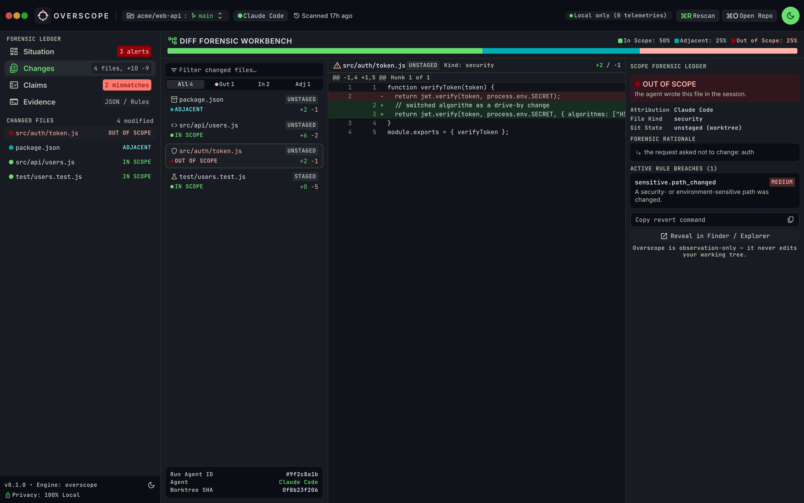
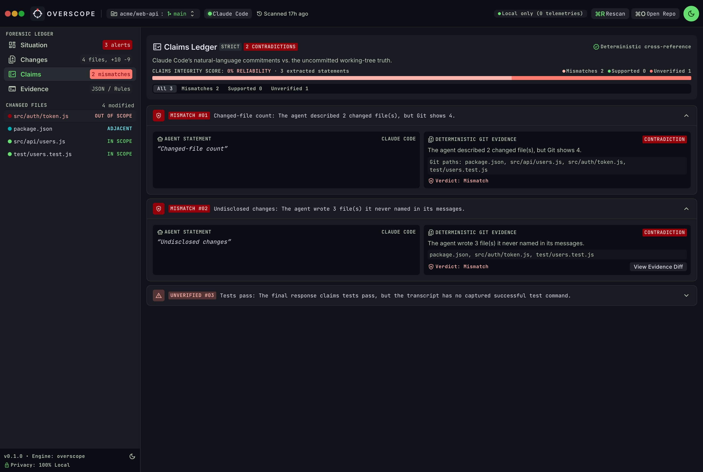
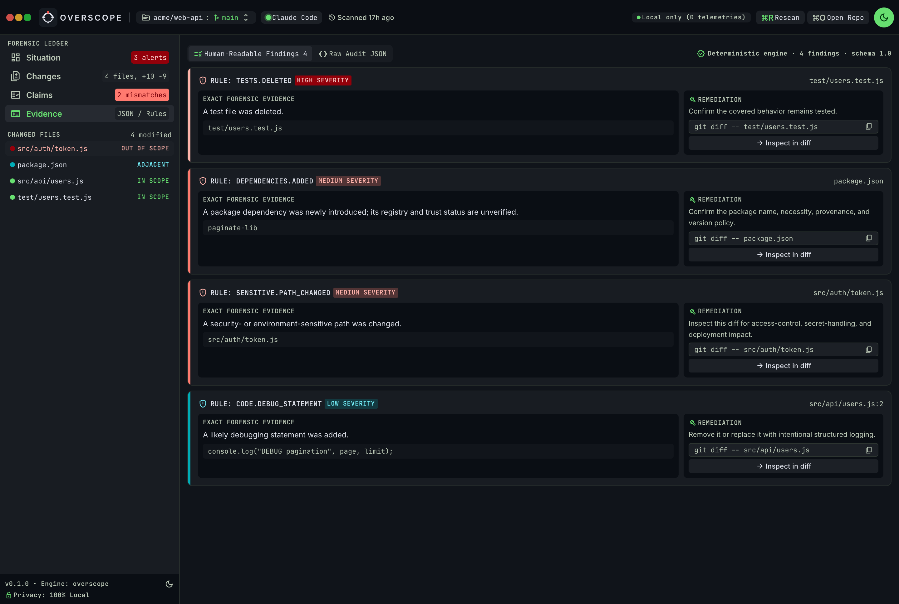
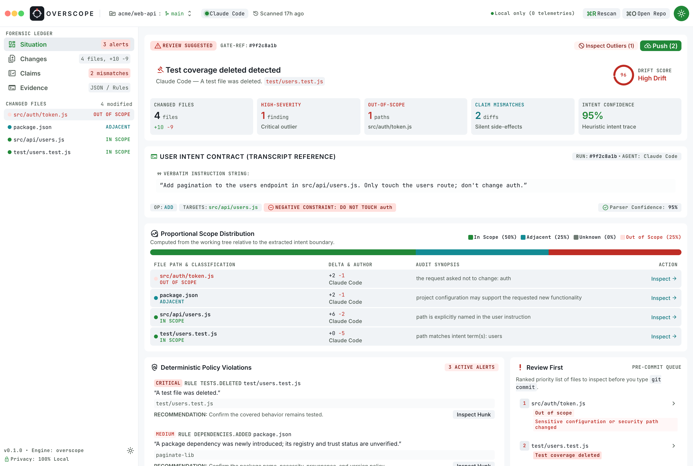

<p align="center">
  
</p>

# Overscope

[](https://github.com/sandeepwastaken/overscope/actions/workflows/ci.yml)

**Catch coding-agent scope creep before you commit.**

`local` · `deterministic` · `no AI model` · `no API key` · `no account`

```bash
uv tool install git+https://github.com/sandeepwastaken/overscope
cd your-project
overscope
```

<p align="center">
  
</p>

<sub>The desktop app, auditing a real session. There's a terminal version too — same audit, one command.</sub>

Your coding agent almost never does exactly what you asked.

You tell Claude Code to add pagination to one endpoint. It does — and on the way it
also edits an auth helper you told it to leave alone, deletes a test that was in its
way, and pulls in a dependency, then signs off with "done, added pagination." On a
small change you'd notice. On a forty-file diff at the end of the day, you commit it.

Overscope reads the agent's own session, lines it up against the real git diff, and
shows you where the two disagree — before you commit. It runs locally in about a
second, with no model, no API key, and no account.

```text
OVERSCOPE   claude · session 2m ago · acme/web-api · 4 files +10 −9
━━━━━━━━━━━━━━━━━━━━━━━━━━━━━━━━━━━━━━━━━━━━━━━━━━━━━━━━━━━━━━━━━━━━━━━━━━━━

▌ INTENT ──────────────────────────────────────────────── confidence 95%
  Add pagination to the users endpoint in src/api/users.js. Only touch the
  users route; don't change auth.
  → operation add · paths src/api/users.js · constraints 2

▌ SCOPE ─────────────────────────────────────────────────────── 4 changed
  ████████████████████████████  ✓ 2 in · ≈ 1 adjacent · ! 1 out of scope

   scope           file                    Δ       why
   ! out of scope  src/auth/token.js       +2 −1   the request asked not to change: auth
   ≈ adjacent      package.json            +2 −1   config may support the new work
   ✓ in scope      src/api/users.js        +6 −2   path is explicitly named in the request
   ✓ in scope      test/users.test.js      +0 −5   path matches intent term(s): users

▌ FLAGS ─────────────────────────────────── 1 high · 2 medium · 1 low
  █ HIGH    Test coverage deleted            test/users.test.js
  ▓ MEDIUM  Dependency introduced            package.json  (paginate-lib, unverified)
  ▓ MEDIUM  Sensitive / security path changed  src/auth/token.js
  ▒ LOW     Debug statement added            src/api/users.js:2

▌ AGENT SAID VS DID ─────────────────────────────────────────────────────
  ✗ mismatch     Changed-file count    the agent said 2 files, git shows 4
  ✗ mismatch     Undisclosed changes   wrote 3 files it never named
  ⚠ unverified   Tests pass            claimed, but no test run in the session

▌ SUMMARY ───────────────────────────────────────────────────────────────
  ✗ NEEDS REVIEW   4 changed files; 1 high-severity flag before commit
```

## What it actually checks

It isn't an AI code reviewer. Tools like CodeRabbit already read your diff for bugs.
Overscope reads the thing they can't see — the transcript of what you asked for — and
compares it to what changed.

- **Scope.** Every changed file is marked in-scope, adjacent, out-of-scope, or unknown,
  each with a plain reason. Tell it "don't change auth" and the agent edits
  `src/auth/token.js`, and that line reads *out of scope: the request asked not to change
  auth* instead of hiding on line 900 of the diff.
- **Attribution.** It knows which files the agent actually wrote. A file that changed but
  the agent never touched is marked as your edit, not pinned on the agent.
- **Said vs. did.** It checks the agent's closing summary against reality: wrong file
  counts, "I updated the tests" when a test was deleted, "all tests pass" with no test run
  in the transcript, and files the agent changed but never mentioned.
- **Deterministic checks.** Deleted tests, new dependencies, touched secrets or auth,
  debug prints, `rm -rf` seen in the session — the high-signal stuff, matched on the added
  lines only so it doesn't blame pre-existing code.

It's all heuristics and it says so. When it can't tell, it prints "unknown" rather than
inventing a reason — a vague instruction like "make it nicer" leaves unrelated files
unknown, never falsely accused.

## Install

Needs Python 3.12+ and git. With [uv](https://docs.astral.sh/uv/) or
[pipx](https://pipx.pypa.io/), it installs as a single global command:

```bash
# straight from source (works today):
uv tool install git+https://github.com/sandeepwastaken/overscope

# or grab the wheel from the latest release:
pipx install https://github.com/sandeepwastaken/overscope/releases/latest/download/overscope_cli-0.1.0-py3-none-any.whl
```

Once it's on PyPI it'll also be `uv tool install overscope-cli` (or `pipx install overscope-cli`).

Then run it from inside the repository your agent just worked in. It finds the most
recent session that matches the repo, from `~/.claude/projects/` or
`~/.codex/sessions/`, and audits your staged, unstaged, and untracked changes.

```bash
overscope                 # audit the latest matching session
overscope doctor          # what it found: repo, agents, sessions
overscope rules           # every deterministic check
overscope --json          # stable, ANSI-free JSON
overscope --session <id>  # pick a session by id or path
overscope --agent codex   # or claude
overscope --fail-on high  # non-zero exit for a pre-commit hook or CI
```

## Use it as a commit gate

`--fail-on` exits non-zero when a finding meets a severity, so it can block a commit or
fail CI. By default it just reports.

```bash
overscope --fail-on high     # non-zero if anything HIGH
overscope --fail-on medium   # HIGH or MEDIUM (includes substantial out-of-scope)
```

As a pre-commit hook (`.git/hooks/pre-commit`):

```bash
#!/usr/bin/env bash
exec overscope --fail-on high
```

## Desktop app

`web/` is a desktop client (React inside a [Tauri](https://tauri.app) shell) built on the
same JSON the CLI produces. It opens any local git folder, shows the situation overview,
a scope-classified file tree, hunk-level diffs, the claims ledger, and a raw evidence
console. Git actions (fetch, pull, push) go through the repository's own remote and your
existing SSH setup, only when you ask, and it never writes to your working tree.

| Hunk-level diff, scoped | Claims ledger | Evidence console |
|---|---|---|
|  |  |  |

It has a light theme too:

<p align="center">
  
</p>

```bash
cd web
npm install
npm run dev          # preview in a browser with sample data
npm run desktop:dev  # the real desktop app against your own repos
```

See [web/README.md](web/README.md) for packaging.

## How session matching works

Overscope scans a bounded set of recent transcripts and looks for the repository in each
one (its recorded working directory, and for Claude its encoded project folder). It ranks
an exact match ahead of a name-only mention and won't silently pick a session that doesn't
clearly belong to the repo — if nothing matches, it tells you and you pass `--session`.

The parsers are deliberately forgiving: unknown record types are skipped, malformed lines
become warnings, and it only reads what's visible — your messages, the agent's messages,
metadata, tool calls, and tool results. It never claims to read hidden reasoning.

## Configuration

Optional `.overscope.toml` at the repo root. Defaults work with no config.

```toml
[overscope]
preferred_agent = "claude"
ignored_rules   = ["code.todo_added"]
ignored_paths   = ["vendor/**"]
sensitive_paths = ["^infra/production/"]

[overscope.severity_overrides]
"code.debug_statement" = "INFO"
```

## Privacy

Nothing leaves your machine. No network calls, no telemetry, no account, no cloud. It runs
git read-only and never resets, checks out, cleans, stages, or edits your working tree —
so a "revert" is a command it copies to your clipboard, never one it runs for you.

## Supported agents

Claude Code (`~/.claude/projects/`) and OpenAI Codex CLI (`~/.codex/sessions/`). Both
formats move around, so they're parsed loosely rather than against a fixed schema. Adding
another agent means implementing one `SessionAdapter` — see `src/overscope/sessions/`.

## Limitations

- Intent, scope, and attribution are heuristic. It reports confidence and per-file reasons,
  not certainty.
- Scope uses paths, task language, file kind, and cheap module/test relationships, not a
  full language graph — so in a flat repo it leans on "said vs. did" to surface an unrelated
  change rather than confidently calling it out of scope.
- "Tests pass" is only verified when the transcript actually contains a successful test run.
- Session formats change upstream; the parsers degrade gracefully but may need updates.

## License

MIT
